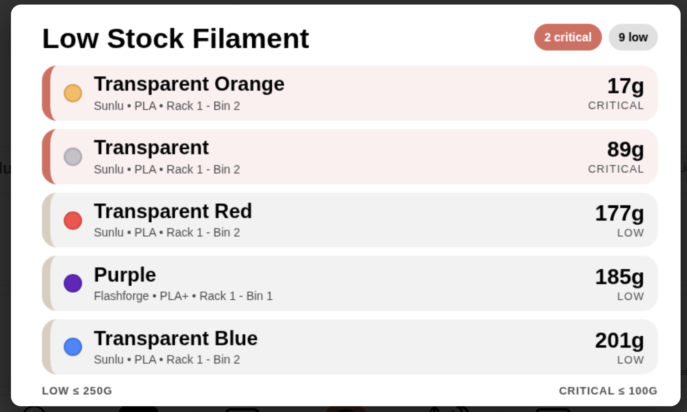
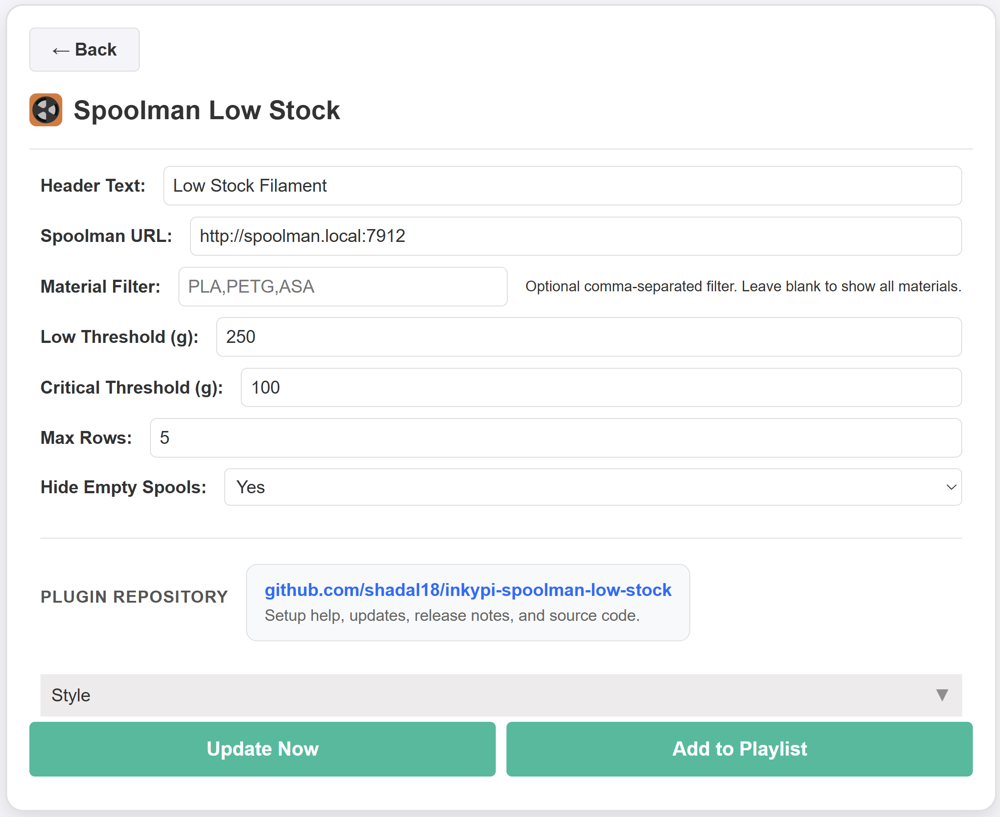

# InkyPi Spoolman Low Stock

A custom InkyPi plugin that shows low-stock Spoolman spools with configurable stock thresholds.

## Install

Use the InkyPi plugin installer with the plugin ID and this repository URL, following the install pattern shown by the official InkyPi plugin template.

```bash
inkypi plugin install spoolman_low_stock https://github.com/shadal18/inkypi-spoolman-low-stock
```

## Update

To update the plugin on your InkyPi device:

1. SSH into your InkyPi host.
2. Change into the plugin directory:
   ```bash
   cd ~/InkyPi/src/plugins/spoolman_low_stock
   ```
3. Run this update command:
   ```bash
   git pull origin main && \
   if [ -d spoolman_low_stock ]; then \
     rsync -a spoolman_low_stock/ ./ && \
     rm -rf spoolman_low_stock; \
   fi && \
   sudo systemctl restart inkypi.service
   ```

If you don’t see your changes after updating:

- Confirm you are in the correct plugin folder.
- Clear your browser cache or hard refresh the InkyPi web UI.
- Check the InkyPi logs for any plugin errors.

## Requirements

- A reachable Spoolman instance with its API available over HTTP.
- Network access from the InkyPi device to the Spoolman host.

## Features

This plugin is an extension for the InkyPi e-paper display frame and includes the following features.

- Shows low-stock spools from Spoolman.
- Highlights critical spools separately from standard low-stock spools.
- Configurable low-stock threshold in grams.
- Configurable critical threshold in grams.
- Optional material filtering.
- Optional hiding of empty spools.
- Configurable maximum number of rows shown on the display.
- Color-focused spool display for quick identification.
- Clean layout optimized for quick glance reading on e-paper.

## Settings

The plugin settings page lets you customize:

- Spoolman URL.
- Header text.
- Material filter.
- Low threshold in grams.
- Critical threshold in grams.
- Maximum rows shown.
- Hide or show empty spools.

## Details

The plugin queries your Spoolman instance over its REST API and filters spools by remaining weight to find reels that are low or critical in stock. Spoolman exposes its API under `/api/v1/`, making it suitable for inventory-driven InkyPi displays.

## Repository

GitHub repository:

[https://github.com/shadal18/inkypi-spoolman-low-stock](https://github.com/shadal18/inkypi-spoolman-low-stock)

## Screenshots

- Main plugin display showing low-stock spools.
- Plugin settings screen.

<p align="center">
  
  
</p>
